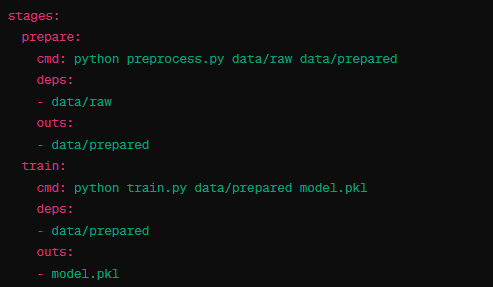

# DVC Pipeline for Oper-AI-tion

DVC (Data Version Control) stands out for its simple and efficient approach, facilitating the organization and versioning of data and ML workflows. It enables control over the order of pipeline execution and tracking of inputs and outputs for each step without requiring additional installations on the VM. The integration of DVC with GitHub Actions enables seamless execution of DVC pipelines on a VM, significantly reducing the complexity of ML orchestration while enhancing workflow flexibility and efficiency.

*Figure: DVC Pipeline for Oper-AI-tion (dvc.yaml)*

In the DVC pipeline, the commands and options `-o`, `-d`, and `-M` are used to define dependencies, outputs, and metrics for the various stages within a pipeline. Each stage is given a name and defines its dependencies and output files. The output of one stage often serves as input for the subsequent stage.

The `-d` parameter is used to specify the dependencies of a stage in the DVC pipeline. Dependencies are input files or directories required for executing a stage. If any of these dependencies change, for example, due to an update in an input file, DVC recognizes that this stage and all subsequent stages need to be re-executed.

The `-o` parameter is used to define the outputs of a stage. These outputs are typically files or directories generated by a stage. DVC monitors the outputs to detect changes and determine if subsequent steps need to be restarted.

The `-M` parameter is used to name metric files. These files typically contain quantifiable results from model training, such as accuracy or precision. Unlike `-o`, DVC tracks metric files without storing them in the DVC cache. This is particularly useful for small files that are frequently updated and should be tracked directly in the Git repository.

The stages in the DVC pipeline for Oper-AI-tion are as follows:

1. **Data Acquisition**: In this step, data is collected and stored from Yortrack. The Python script `acquire_data.py` is used to download the required data and store it in the `data/raw` directory. This phase is documented with a specific DVC stage (`acquire_data`) that automates all necessary steps and versions the collected data.

2. **Data Preparation**: The raw data is cleaned and prepared by the script `prepare_data.py`. The result of this process is stored in `data/processed`. This preparation phase is captured in the DVC stage (`prepare_data`), which automates the data transformation and versions the prepared data.

3. **Model Training**: Model training is performed by the script `train_model.py`. Not only is the model trained with the prepared data, but an MLflow experiment is also created, tracking all relevant training metrics, parameters, and the model itself. These training steps are documented in the DVC stage (`train_model`), which also includes the integration with MLflow.

4. **Model Evaluation**: The script `evaluate_model.py` evaluates the performance of the trained model and stores the evaluation results. If the model meets certain performance criteria, it is automatically registered in the MLflow Model Registry and transitioned to the appropriate stage (e.g., "Staging"). These evaluation and registration processes are summarized in the DVC stage (`evaluate_model`).

Each of these stages represents a crucial step in the ML workflow and is orchestrated by DVC in a reproducible and traceable manner. The use of scripts in conjunction with DVC stages enables the Oper-AI-tion team to efficiently manage the entire workflow, from data acquisition to model evaluation.

To execute a single stage, the command `dvc repro` followed by the stage name can be used. For example, `dvc repro train_model` would only run the `train_model` stage and its dependencies. To run all stages in the pipeline, simply use `dvc repro` without additional arguments. DVC analyzes the pipeline and executes all stages whose dependencies have changed, as well as all downstream stages affected by these changes.