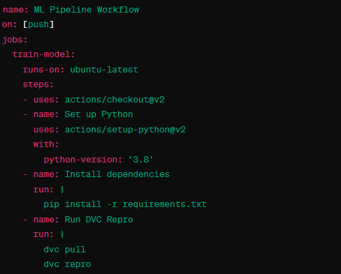

# GitHub Actions for DVC Pipeline Automation

In this project, GitHub Actions is utilized as a central tool to automatically execute the predefined DVC pipeline.

*Figure: GitHub Actions for DVC Pipeline Automation*

The steps involved in setting up GitHub Actions for the DVC pipeline are as follows:

1. **Creating the Workflow File**: First, a new YAML file named `dvc_pipeline.yml` should be created in the `.github/workflows` directory of the project repository.

2. **Workflow Definition**: In the created `dvc_pipeline.yml` file, the workflow should be defined as shown in Figure 1.

3. **on**: Here, it is specified that the workflow should be triggered by events such as `push` or `pull_request` on the `main` branch.

4. **jobs**: The jobs to be executed are defined here, in this example, a job named `run-dvc`.

5. **steps**: The steps within each job are defined. First, the repository is checked out, Python is set up, DVC is installed, `dvc pull` and `dvc repro` are executed to reproduce the pipeline, and finally, all changes are uploaded.

This integrated approach promotes reproducibility and efficiency, as the team maintains full control over the ML lifecycle and can systematically analyze changes. The combination of DVC pipelines, Git Actions, and CML ensures that the Oper-AI-tion project fully leverages the benefits of modern MLOps practices, leading to faster development and higher quality of ML models.