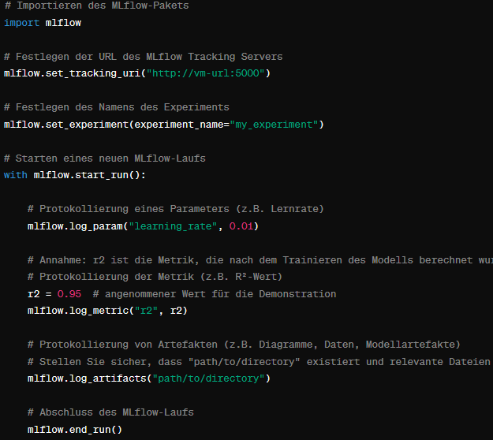

# MLflow Tracking Server Setup

The MLflow Tracking Server was initially installed on the VM using Docker Compose. After successful installation, the data scientists connected their local machines to the server. Once connected to the MLflow server, the data scientists could perform experiments, whether in Jupyter Notebooks or other scripts. To integrate with MLflow, the tracking URI needs to be set, and an experiment name defined. During the experiments, parameters, metrics, and artifacts were logged using MLflow.

*Figure: Using MLflow for tracking a machine learning experiment*

The steps involved in using MLflow for experiment tracking are as follows:

1. **Import MLflow**: First, the MLflow package is imported to gain access to the tracking functions.

2. **Set Tracking URI**: Here, the address of the MLflow Tracking Server is set, which records all experiment data.

3. **Set Experiment**: This step names the experiment. If the specified experiment does not exist, it is created.

4. **Start Run**: `mlflow.start_run()` starts a new run. All subsequent tracking actions will be associated with this run.

5. **Log Parameters**: `mlflow.log_param()` is used to log hyperparameters such as the learning rate.

6. **Log Metrics**: `mlflow.log_metric()` is used to log metrics such as the R² value.

7. **Log Artifacts**: `mlflow.log_artifacts()` is used to log additional information such as plots or data stored in the specified directory.

8. **End Run**: Finally, the MLflow run is ended using `mlflow.end_run()`.